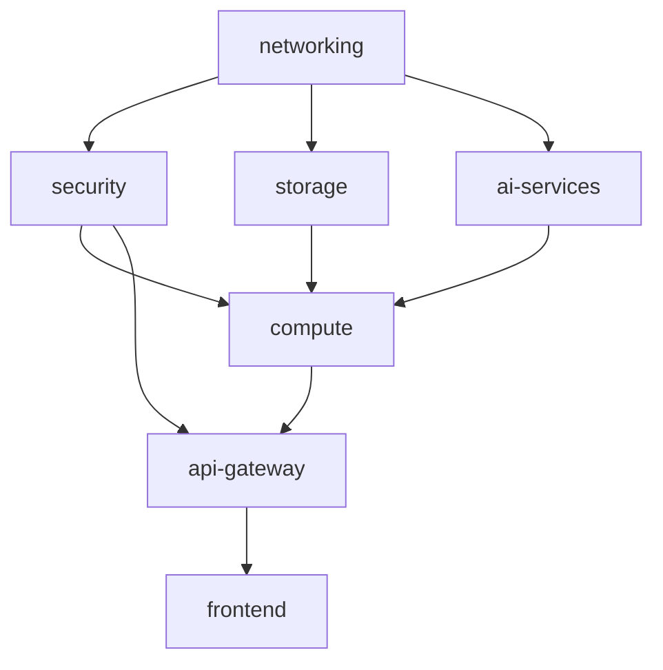

# AI Assistant Infrastructure

**Author:** Ruben Martin  
**Date:** 2025-07-03  
**Version:** 1.0.0

## 📋 Descripción

Infraestructura completa para un asistente de IA empresarial con capacidades de procesamiento de texto y voz, análisis de documentos, y acceso multinivel basado en roles.

## 🏗️ Arquitectura

### Componentes Principales

- **🌐 Networking**: VPC multi-AZ con subredes públicas y privadas
- **🔐 Security**: Cognito, IAM, Security Groups, WAF
- **💾 Storage**: S3 Data Lake + Aurora MySQL Serverless v2  
- **🤖 AI Services**: OpenSearch, Bedrock, SageMaker opcional
- **⚡ Compute**: ECS Fargate + Lambda Functions
- **🌍 API Gateway**: REST API con autenticación
- **📱 Frontend**: S3 + CloudFront CDN

### Capacidades del Asistente

✅ **Procesamiento Multimodal**
- Texto y voz (Transcribe + Polly)
- Documentos PDF, Word, Excel  
- Imágenes y videos
- Generación de documentos

✅ **Búsqueda Inteligente**
- Búsqueda semántica con vectores
- OpenSearch para embeddings
- Acceso a Data Lake estructurado

✅ **Seguridad Empresarial**
- Control de acceso basado en roles
- Cifrado end-to-end
- Auditoría completa

## 🚀 Despliegue Rápido

### Prerrequisitos

1. **Terraform >= 1.5**
2. **AWS CLI configurado**
3. **Bucket S3 para estado de Terraform**
4. **Tabla DynamoDB para bloqueo de estado**

### Configuración Inicial

```bash
# 1. Clonar repositorio
git clone <repository-url>
cd ai-assistant-terraform

# 2. Configurar variables de entorno
export TF_VAR_terraform_state_bucket="mi-bucket-terraform-state"
export TF_VAR_terraform_lock_table="mi-tabla-terraform-locks"
export TF_VAR_owner="Mi Equipo DevOps"

# 3. Personalizar configuración
cp environments/prod.tfvars environments/mi-entorno.tfvars
# Editar mi-entorno.tfvars con tus valores
```

### Despliegue por Entornos

```bash
# Desarrollo
terraform init
terraform plan -var-file="environments/dev.tfvars"
terraform apply -var-file="environments/dev.tfvars"

# Producción  
terraform plan -var-file="environments/prod.tfvars"
terraform apply -var-file="environments/prod.tfvars"
```

## ⚙️ Configuración

### Variables Principales

| Variable | Descripción | Valor por Defecto |
|----------|-------------|-------------------|
| `project_name` | Nombre del proyecto | `"ai-assistant"` |
| `environment` | Entorno (dev/staging/prod) | **Requerido** |
| `aws_region` | Región AWS | `"us-east-1"` |
| `domain_name` | Dominio personalizado | `null` |
| `vpc_cidr` | CIDR de la VPC | `"10.0.0.0/16"` |

### Configuración de Base de Datos

```hcl
aurora_config = {
  engine_version      = "8.0.mysql_aurora.3.02.0"
  instance_class      = "db.serverless"
  max_capacity        = 16    # ACUs para producción
  min_capacity        = 2     # ACUs mínimas
  backup_retention    = 30    # Días de backup
  deletion_protection = true  # Protección contra borrado
}
```

### Configuración de OpenSearch

```hcl
opensearch_config = {
  instance_type  = "t3.medium.search"  # Para producción
  instance_count = 3                   # Alta disponibilidad
  volume_size    = 100                 # GB por nodo
  volume_type    = "gp3"               # SSD de última generación
}
```

## 🔧 Módulos

### 📁 Estructura de Módulos

```
modules/
├── networking/          # VPC, subredes, gateways
├── security/           # Cognito, IAM, Security Groups
├── storage/            # S3 Data Lake, Aurora MySQL
├── ai-services/        # OpenSearch, Bedrock
├── compute/            # ECS, Lambda (a implementar)
├── api-gateway/        # API REST (a implementar)
├── frontend/           # S3, CloudFront (a implementar)
└── abstractions/       # Abstracción multinube
```

### 🔗 Dependencias entre Módulos



## 💰 Estimación de Costos

### Entorno de Desarrollo

| Servicio | Costo Mensual (USD) |
|----------|---------------------|
| **Compute** (ECS + Lambda) | $150 |
| **Database** (Aurora) | $100 |
| **Storage** (S3 + OpenSearch) | $50 |
| **AI Services** (Bedrock) | $200 |
| **Networking** | $50 |
| **Total** | **$550** |

### Entorno de Producción

| Servicio | Costo Mensual (USD) |
|----------|---------------------|
| **Compute** (ECS + Lambda) | $800 |
| **Database** (Aurora) | $500 |
| **Storage** (S3 + OpenSearch) | $300 |
| **AI Services** (Bedrock) | $1,500 |
| **Networking** | $200 |
| **Total** | **$3,300** |

> 💡 **Optimización**: Los costos pueden reducirse significativamente con Reserved Instances y optimización de uso.

## 🌍 Capacidad Multinube

### Soporte Actual
- **✅ AWS**: Implementación completa
- **🔄 Azure**: Abstracción preparada  
- **🔄 GCP**: Abstracción preparada

### Equivalencias de Servicios

| AWS | Azure | GCP |
|-----|-------|-----|
| S3 | Blob Storage | Cloud Storage |
| Aurora | Database for MySQL | Cloud SQL |
| OpenSearch | Cognitive Search | Vertex AI Search |
| Lambda | Functions | Cloud Functions |
| Bedrock | OpenAI Service | Vertex AI |

### Migración Multinube

```bash
# Cambiar proveedor en configuración
terraform apply -var="cloud_provider=azure"
```

## 🔒 Seguridad

### Características de Seguridad

✅ **Cifrado End-to-End**
- KMS para datos en reposo
- TLS para datos en tránsito
- Secrets Manager para credenciales

✅ **Control de Acceso**
- Cognito para autenticación
- IAM roles con mínimos privilegios
- Security Groups con reglas específicas

✅ **Protección Web**
- AWS WAF con reglas managed
- Rate limiting automático
- Protección DDoS con CloudFront

✅ **Auditoría**
- CloudTrail para API calls
- CloudWatch para logs
- Performance Insights para BD

### Configuración de Seguridad

```hcl
# Restringir acceso a redes corporativas
allowed_cidr_blocks = [
  "10.0.0.0/8",        # Red corporativa interna  
  "203.0.113.0/24"     # IPs públicas de oficina
]

# Habilitar WAF
enable_waf = true
```

## 📊 Monitoreo

### Logs Centralizados

- **CloudWatch Logs**: Aplicaciones y servicios
- **OpenSearch Logs**: Rendimiento de búsquedas  
- **Aurora Logs**: Queries lentas y errores
- **Bedrock Logs**: Uso de modelos IA

### Métricas Clave

- **Latencia de API**: < 500ms p95
- **Disponibilidad**: > 99.9%
- **Escalado Aurora**: Automático 0.5-128 ACUs
- **Rate Limiting**: 2000 req/min por IP

## 🔧 Desarrollo Local

### Docker Compose

```bash
# Entorno completo de desarrollo
docker-compose up -d

# Servicios incluidos:
# - MySQL (puerto 3306)
# - Redis (puerto 6379)  
# - OpenSearch (puerto 9200)
# - LocalStack (puerto 4566)
# - Prometheus (puerto 9090)
# - Grafana (puerto 3001)
```

### Endpoints Locales

- **Frontend**: http://localhost:3000
- **API**: http://localhost:8000
- **OpenSearch**: http://localhost:9200
- **Grafana**: http://localhost:3001

## 📝 Mantenimiento

### Actualizaciones

```bash
# Actualizar módulos
terraform get -update

# Aplicar cambios
terraform plan -var-file="environments/prod.tfvars"
terraform apply -var-file="environments/prod.tfvars"
```

### Backup y Recuperación

- **Aurora**: Backups automáticos (7-35 días)
- **S3**: Versionado + Lifecycle policies
- **OpenSearch**: Snapshots automáticos
- **Terraform State**: Versionado en S3

### Escalado

- **Aurora**: Automático basado en demanda
- **OpenSearch**: Manual o automático
- **ECS**: Automático basado en CPU/memoria
- **Lambda**: Automático hasta límites

## 🆘 Troubleshooting

### Problemas Comunes

**Error de Estado de Terraform**
```bash
# Desbloquear estado
terraform force-unlock <LOCK-ID>

# Refrescar estado
terraform refresh -var-file="environments/prod.tfvars"
```

**Fallos de Conectividad de BD**
```bash
# Verificar security groups
aws ec2 describe-security-groups --group-ids <SG-ID>

# Verificar endpoints
aws rds describe-db-clusters --db-cluster-identifier <CLUSTER-ID>
```

**Problemas de OpenSearch**
```bash
# Verificar estado del cluster
curl -X GET "https://<OPENSEARCH-ENDPOINT>/_cluster/health"

# Verificar índices
curl -X GET "https://<OPENSEARCH-ENDPOINT>/_cat/indices"
```

## 📞 Soporte

### Contacto

- **Arquitecto**: Ruben Martin
- **Fecha Creación**: 2025-07-03
- **Repositorio**: [GitHub Repository]
- **Documentación**: [Wiki/Confluence Link]

### Recursos Adicionales

- [AWS Well-Architected Framework](https://aws.amazon.com/architecture/well-architected/)
- [Terraform Best Practices](https://www.terraform.io/docs/cloud/guides/recommended-practices/)
- [Amazon Bedrock Documentation](https://docs.aws.amazon.com/bedrock/)

---

**© 2025 - Infraestructura diseñada por Ruben Martin**